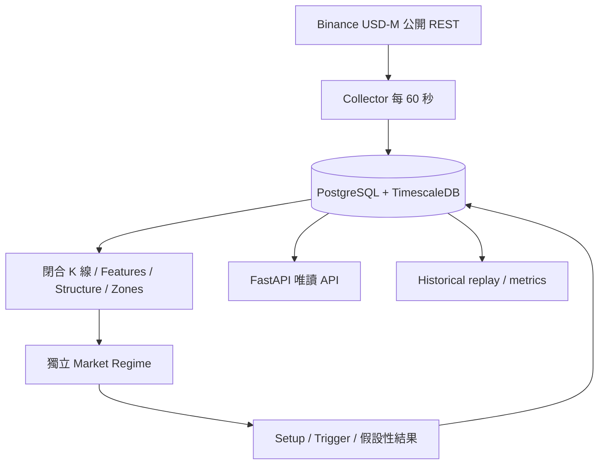

# StarPulse v2 Core 架構

狀態：第 42 節 Core 的實作契約；v1 基準 `f8c72e4` 保留於 `main`，Core 在本機 `v2` 開發。

## 本次交付範圍

完成企劃審查、這組設計文件，以及 BTCUSDT／ETHUSDT／ENAUSDT 的資料、分析、Trend Pullback、假設性持倉追蹤、永久訊號歷史與唯讀 API。設定可擴充至 BNBUSDT／SOLUSDT／SUIUSDT；BTC／ETH 為 Market Regime 必要資產。四個級別為 15m、1h、4h、1d。

原企劃第 36／38 節的完整 MVP 比 Core 大；Breakout Retest、完整 90 天策略回測報告、React UI、通知與進階資料是後續里程碑，不把 Core 驗收當成全產品驗收。詳細差異見 [企劃審查](v2-review.md)。

設計文件：[Market Regime](market-regime.md)、[Support / Resistance](support-resistance.md)、[Signal Engine](signal-engine.md)、[Backtest](backtest.md)、[Database](database.md)、[API](api.md)。

## 運行路徑

Collector 與 API 為兩個獨立程序；分析在每個 Collector cycle 後執行。PostgreSQL advisory lock 保證同時只有一個 evaluator；API 不啟動收集器。所有 persistent state 放 DB，不依賴容器記憶體。Compose 使用 named volume；重建容器不刪歷史。

Core 用 REST closed-bar polling；15m Trigger 不需要秒級行情。每個完整分頁提交後可續傳，網路恢復時補齊 watermark 後的缺漏。WebSocket、Redis、消息佇列與多 worker 留待實際延遲／容量需求出現。

## 目錄責任

| 路徑 | 責任 |
|---|---|
| `services/collector.py` | 公開市場、邊界驗證、限次重試、續傳 |
| `services/analysis.py` | 無 I/O 指標、確認轉折、區域、市場環境 |
| `services/signals.py` | Setup、固定快照、Trigger、狀態／結果 |
| `services/backtest.py` | 重用狀態機回放與績效統計 |
| `services/pipeline.py` | freshness、跨資產整合、去重及持久化 |
| `services/storage.py` | SQL、transaction、migration |
| `apps/api/main.py` | Pydantic/FastAPI 參數驗證與唯讀路由 |
| `database/migrations/` | 具 checksum 的版本化 schema |
| `tests/` | deterministic fixture 與真實 DB/API 整合測試 |

保留 v1 JavaScript 全部外部行為。Python 指標沿用原有 SMA seed／Wilder 計算規則與 golden fixture，不把指標分數稱為勝率。NumPy／Polars 在少量數列無必要，不增加兩套 dataframe 表示。

## 資料契約與安全失敗

- 市場一致性：OHLCV、Funding、OI 都來自 Binance USD-M 永續，exchange=`binance_usdm`，不能把 spot 價格當 futures 的成交結果。
- UTC 毫秒整數；OHLCV 有 source open/close time；derivatives 同時有來源 timestamp 與 available_at。
- 只接受已閉合、連續、排序且數值有限的 K 線；至少 220 根初始化，分析讀取最近最多 240 根。
- 各級別按應有的最近閉合時間判斷 freshness，收盤邊界容許 120 秒採集延遲。Funding／OI 最長 5 分鐘。
- 關鍵資料 stale／unavailable 禁止新 Setup；最後快照仍可讀，明確標 stale。既有假設性持倉以已保存 K 線結算，不假造缺失 OHLC。
- `ACTIVE` 是模擬追蹤，沒有自動下單、交易所私鑰或實際使用者持倉。
- API `/health` 檢查程序／DB；`/api/v1/health` 檢查資料，不把程序存活等同行情可用。

## 啟動與驗收

PowerShell：設定 `$env:POSTGRES_PASSWORD` 為自訂資料庫密碼，再執行 `docker compose up -d --build`。API 綁定 `127.0.0.1:8000`，互動契約在 `/docs`；DB 不發布主機 port。連續更新與行情可用性以 `/api/v1/health` 及 Collector logs 驗證。請勿使用 `down -v` 除非明確要永久刪除資料。

本機檢查：`python -m venv .venv`、`.venv/Scripts/python -m pip install -r requirements.txt`、`.venv/Scripts/python -m unittest discover -s tests -v`。真實 DB 測試必須提供指向獨立 `starpulse_test` 資料庫的 `TEST_DATABASE_URL`，否則會明確 skip。原 README 的 12 項 v1 檢查仍需全數通過。

框架查核：[FastAPI lifespan](https://fastapi.tiangolo.com/advanced/events/)、[Psycopg transactions](https://www.psycopg.org/psycopg3/docs/basic/transactions.html)、[Timescale SQL API](https://github.com/timescale/timescaledb/blob/main/sql/ddl_api.sql)。
